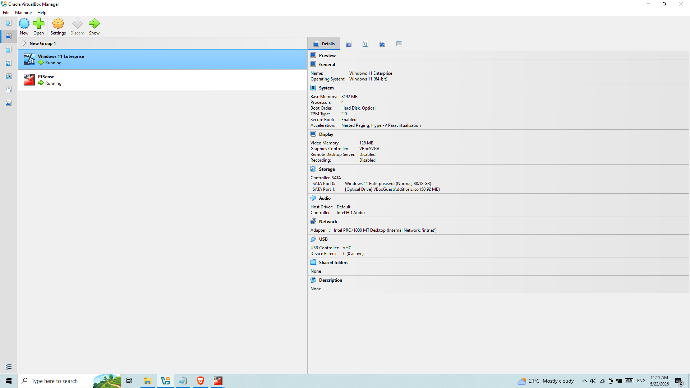
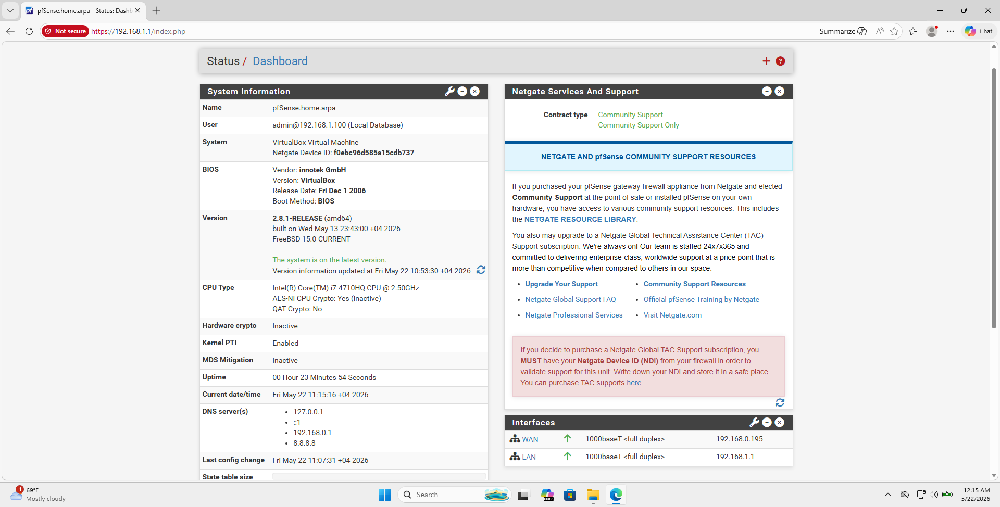
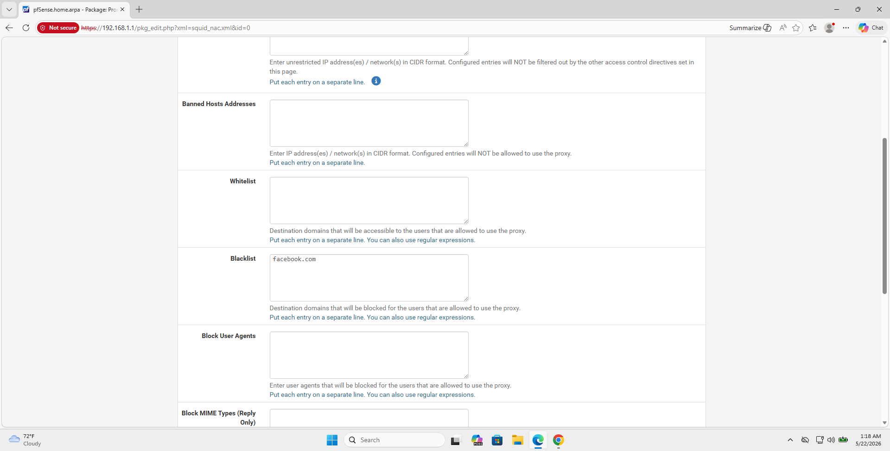
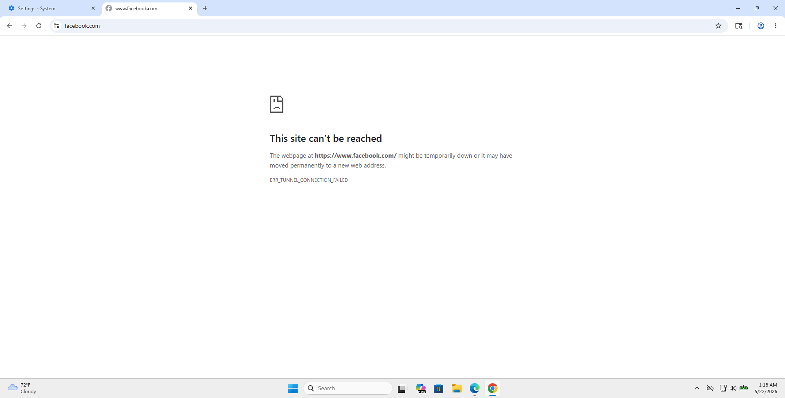
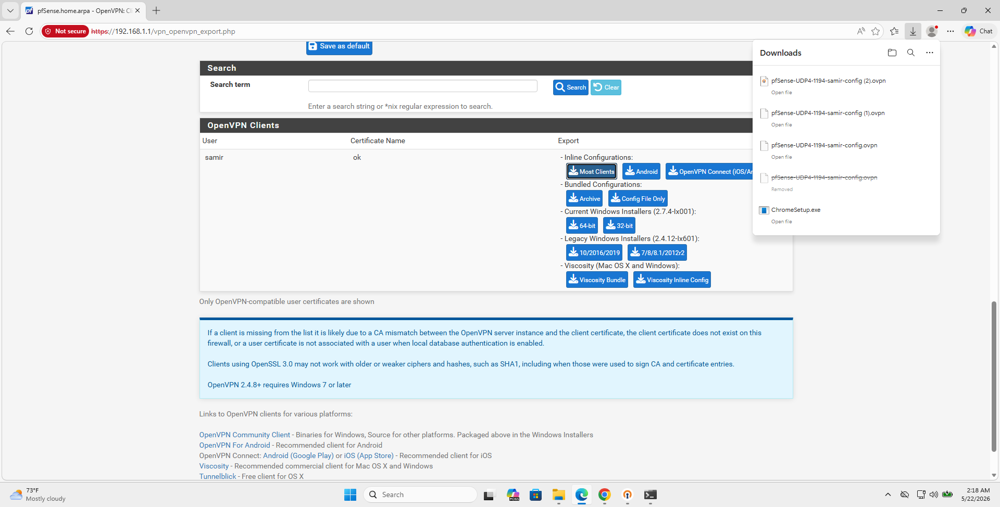
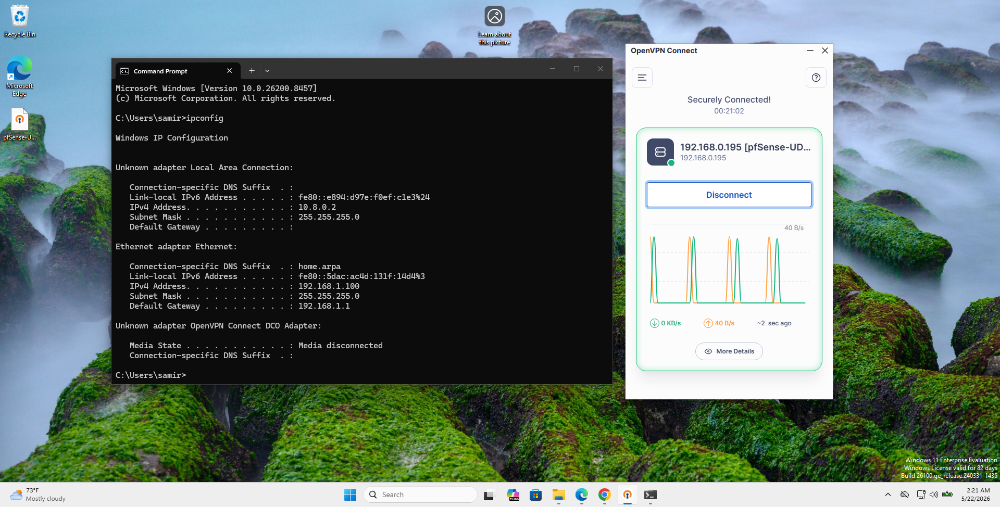
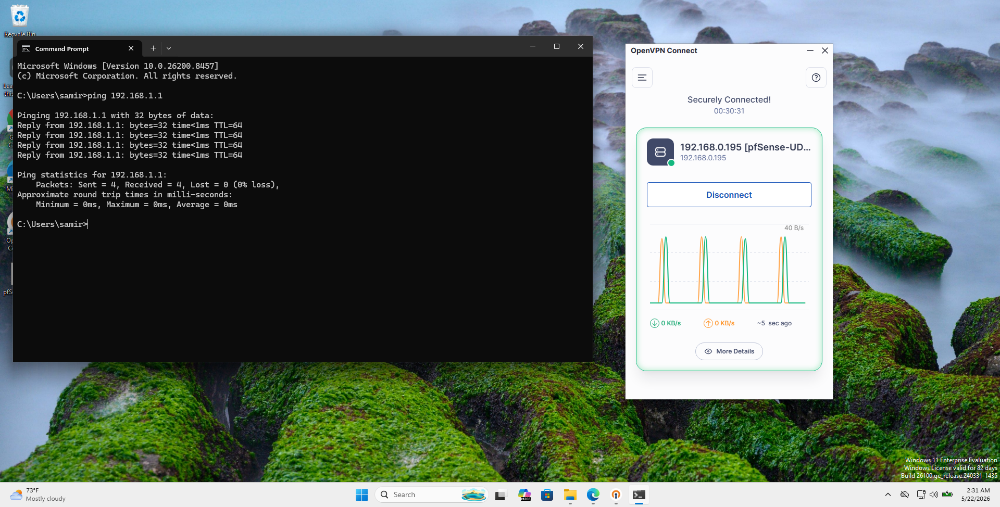

# pfSense Network Security Lab - Firewall, VPN and Web Filtering Implementation

## Project Description

This project demonstrates the deployment of a virtual network security environment using pfSense.

A virtual lab was built using VirtualBox, consisting of:
- pfSense firewall appliance
- Windows 11 Enterprise client machine

The project included:
- Firewall configuration
- Web filtering using Squid Proxy
- Secure remote access using OpenVPN
- Internal network connectivity validation through VPN access testing

Squid Proxy was configured to block access to specific websites through blacklist-based filtering policies.

OpenVPN was deployed to provide encrypted remote access to the internal pfSense network.

Network connectivity and access control were validated by successfully connecting to the VPN and accessing internal network resources through ICMP testing.

The goal of the lab was to simulate a small enterprise-style network environment with security controls, web filtering, firewall management, and encrypted remote access capabilities.

---

## Tools Used

- pfSense
- OpenVPN
- Squid Proxy
- VirtualBox
- Windows 11 Network Tools

---

## Network Security Lab Environment

### 1. VirtualBox Lab Infrastructure

This screenshot shows the VirtualBox environment with two active virtual machines:
- pfSense
- Windows 11 Enterprise

The environment represents the base infrastructure of the network security lab.

---

### 2. pfSense Dashboard

This screenshot displays the pfSense dashboard showing:
- System status
- Network interfaces
- Running services

The dashboard confirms that the firewall system is operational and properly configured.

---

### 3. Squid Proxy Web Filtering Configuration

This screenshot shows the Squid Proxy blacklist configuration inside pfSense.

The domain `facebook.com` was added to the blacklist to demonstrate implementation of web filtering and access control policies.

---

### 4. Web Filtering Enforcement

This screenshot confirms that access to `facebook.com` is successfully blocked through Squid filtering rules.

The result demonstrates active enforcement of proxy-based content filtering policies.

---

### 5. OpenVPN Client Configuration Export

This screenshot shows the OpenVPN Client Export section within pfSense.

The `.ovpn` configuration file is generated for secure client connection setup.

---

### 6. Active OpenVPN Connection

This screenshot shows an active OpenVPN connection on Windows 11 with assigned VPN IP address `10.8.0.2`.

The connection confirms successful VPN tunnel establishment and encrypted remote access functionality.

---

### 7. VPN Access to Internal pfSense Network

This screenshot shows successful ICMP communication with internal pfSense LAN address `192.168.1.1`.

The successful ping confirms that remote VPN access to the internal network is functioning correctly.

---

## Project Outcome

Successfully deployed a functional pfSense-based network security environment with firewall services, Squid web filtering, and OpenVPN remote access.

The project demonstrates practical experience with network security administration, VPN deployment, proxy filtering, firewall management, and secure remote connectivity within a simulated enterprise environment.
